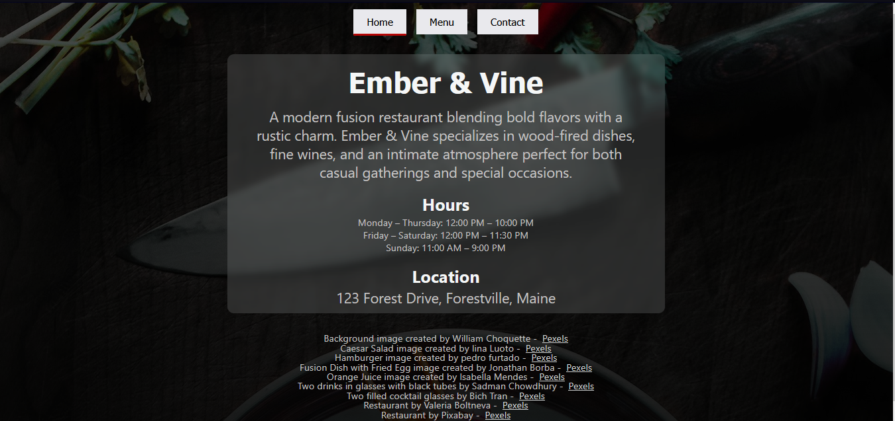
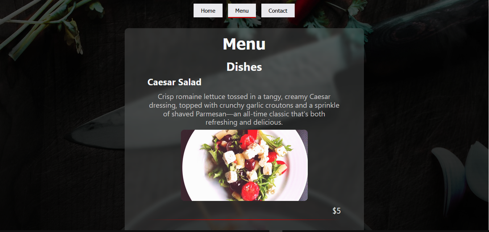
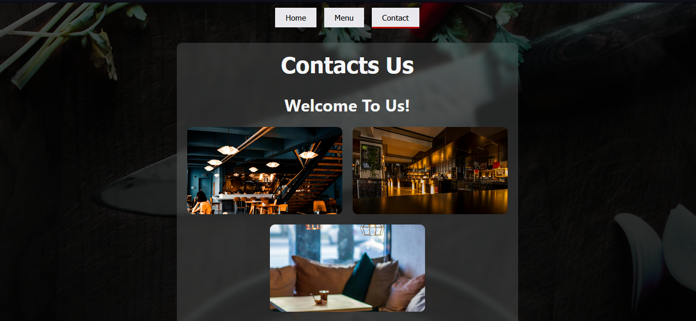

# Restaurant Homepage

This project demonstrates dynamic DOM manipulation using JavaScript to render an entire restaurant website without static HTML content. The goal is to practice working with modules, event listeners, and DOM updates while keeping styling in a separate CSS file.

## Features

- Full page content dynamically generated through JavaScript
- Modular structure for different sections (Home, Menu, Contact)
- Event-driven navigation using button elements
- Adaptive design techniques for responsive layouts
- Semantic HTML improvements for better accessibility

## Screenshots

## Original Assignment

For reference, the original assignment can be found [here](https://www.theodinproject.com/lessons/node-path-javascript-restaurant-page).

## Technologies Used

- JavaScript (ES6 Modules)
- Webpack for bundling
- HTML (Semantic Markup)
- CSS (Styling & Adaptive Design)
